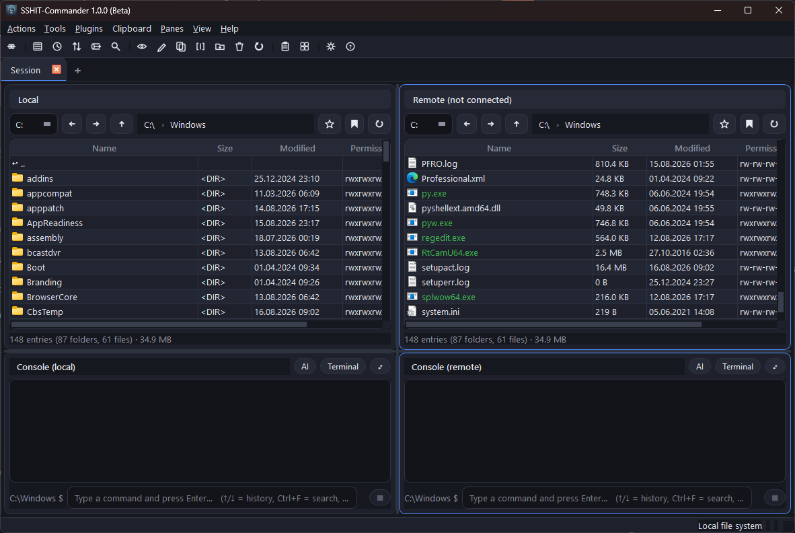

# SSHIT-Commander

**Dual-pane file manager with SSH/SFTP and a terminal**, for Windows.

Two panes for local and remote directories, paired with a full SSH console and a
real terminal. Written in C++20 with Qt 6 and libssh2.

> **Status: beta.** The application works and is covered by 186 automated tests;
> the SSH layer has been validated against a real OpenSSH server. Broad testing
> across different servers is still outstanding — see
> [Known limitations](#known-limitations).



## Features

- **File management**: two panes (local ⇄ remote), copy/move with a progress
  queue, bandwidth limit, pause/resume, drag & drop, bulk rename, directory and
  file comparison, checksums, ZIP, symlinks, permission editor (chmod), file
  preview, tile and list view, per-server bookmarks (with import/export).
- **SSH/SFTP**: profile management, authentication by password, key or agent,
  PuTTY PPK import, host key checking (TOFU) with OpenSSH `known_hosts`
  interoperability and a known-hosts manager, ProxyJump/bastion, port forwarding
  (`-L`/`-R`/`-D` with SOCKS5), sudo filesystem, key generation
  (Ed25519/RSA/ECDSA) and OpenSSH ↔ PPK conversion.
- **Terminal & console**: a real PTY (local via ConPTY, remote via SSH) with a
  full VT100/xterm emulator — `vim`, `htop`, `tmux` and `less` all work.
  Switchable between command and terminal mode, history, scrollback search,
  session logging, and broadcasting a command to both consoles at once.
- **Automation**: **macro manager** with a key grid, layers and a sequence
  editor · **SFTP batch** with script editor, live log and scheduling ·
  **alarm triggers** for directories (local and remote) with glob filters,
  command execution and desktop notifications · **GitHub repo alarm**
  (reports new pushes; token stored in Windows Credential Manager) ·
  **plugins**: hook in external programs, with parameters and context-menu entries.
- **Tools**: editor with syntax highlighting, line numbers and a minimap ·
  file and content search (grep) · **network scanner** (hosts, ports,
  MAC/vendor, shares) · security audit with CVE lookup via OSV.dev ·
  character-set converter (including EBCDIC) · venv/pipenv management ·
  command palette with catalogue and wizard · clipboard history ·
  history & favourites · AI assistant backed by a local Ollama (explain terminal
  output, ask questions about files, source-code error analysis).
- **User interface**: tabs with saveable layouts (tab favourites), panes
  horizontal or vertical, swap and synchronise, filesystem-only and
  terminal-only views, undockable consoles, freely assignable keyboard
  shortcuts, four themes plus your own via the theme editor, German and English.

## Architecture

Strictly layered — the GUI only ever sees the core interfaces:

```
src/
├── main.cpp               # entry point
└── ncssh/
    ├── config.hpp/.cpp    # config paths, atomic writes
    ├── core/              # free of UI and networking: models, FileSystemProvider,
    │                      # CommandRunner, command catalogue, profiles, i18n, …
    ├── net/               # libssh2: session, SFTP provider, remote runner,
    │                      # transfer, tunnels, Ollama, OSV.dev
    └── gui/               # Qt Widgets interface
        └── bridge.hpp     # worker threads <-> Qt signals
```

Key abstractions: `FileSystemProvider` (local vs. SFTP) and `CommandRunner`
(local vs. remote). Every blocking operation runs through `AsyncBridge` on
worker threads — the window never freezes during SSH operations or transfers.

## Building

**Prerequisites**

- Windows 10/11 (x64)
- Visual Studio 2022 with the C++ workload (MSVC, CMake, Ninja)
- Qt 6.8 for MSVC x64
- Internet access on the first configure — libssh2 is fetched via CMake
  FetchContent

**Compiling**

```powershell
.\build.ps1            # configures + builds (Ninja, RelWithDebInfo)
.\build.ps1 -Fresh     # delete build/ and reconfigure
.\build\sshit-commander.exe
```

If Qt is not installed at `C:\Qt\6.8.2\msvc2022_64`, pass the path once:

```powershell
cmake --preset default -DCMAKE_PREFIX_PATH="D:/Qt/6.8.2/msvc2022_64"
```

`windeployqt` runs automatically after the build and places the required Qt DLLs
and plugins next to the executable — the `build\` folder is then ready to run.

**Distributable package** (executable, Qt DLLs/plugins and documents only, no
build internals):

```powershell
.\build.ps1 -Package
```

Produces `build\SSHIT-Commander-<version>.zip`.

**Tests**

```powershell
.\test.ps1             # 186 tests (or: ctest --test-dir build)
```

### Crypto backend (WinCNG or OpenSSL)

- **Default: WinCNG** (`-DUSE_OPENSSL_BACKEND=OFF`). No OpenSSL required, but
  **no ed25519/curve25519**. `ENABLE_ECDSA_WINCNG` enables ecdsa host keys and
  ecdh-sha2-nistp* key exchange, so standard OpenSSH servers (which offer
  several algorithms) work. It only fails against servers that offer
  *exclusively* ed25519/curve25519, or with ed25519 **login keys**.
- **Opt-in: OpenSSL** (`-DUSE_OPENSSL_BACKEND=ON`) → ed25519/curve25519 + ecdsa.
  `cmake/OpenSSLBackend.cmake` provides OpenSSL in one of two ways:
  1. point `-DOPENSSL_ROOT_DIR=<path>` at a prebuilt static OpenSSL, **or**
  2. build from source (OpenSSL 3.3.2, `Configure VC-WIN64A no-asm no-shared`,
     `nmake` — **no nasm needed**). The result is cached in the build directory.
- **Requirement for option 2:** a complete perl (Strawberry/ActiveState) that
  includes `Locale::Maketext::Simple` — the perl shipped with Git Bash is NOT
  sufficient. If needed, force one with `-DOPENSSL_PERL=<path/perl.exe>`. Run
  from an MSVC environment (vcvars) so that `nmake`/`cl` are available.
- libssh2 then uses its OpenSSL path, where `LIBSSH2_ED25519=1` applies for
  OpenSSL ≥ 1.1.1 and X25519 is compiled in. Linked statically (no libcrypto
  DLL). If you use it, keep OpenSSL on a maintained branch (CVEs).

## Configuration

Settings, profiles and bookmarks live in `%APPDATA%\ncssh`. Passwords and tokens
go into the **Windows Credential Manager**, not into the configuration files.

## Known limitations

- **Windows only.** ConPTY, the Credential Manager and the macro actions use the
  Win32 API directly.
- The default build (WinCNG) lacks **ed25519 host keys and curve25519**. Servers
  offering ecdsa/rsa and ecdh/DH — the OpenSSH default configuration — work
  fine; only servers that offer *exclusively* ed25519/curve25519, as well as
  ed25519 **login keys**, require the OpenSSL build.
- **Agent forwarding** is not possible: libssh2 cannot accept the agent channels
  the server opens back. The option is therefore deliberately disabled rather
  than appearing to work.
- No system-wide macro hotkeys (macro keys are triggered by clicking).
- Not broadly tested: unusual auth/SFTP/tunnel combinations, ProxyJump and
  ed25519 handshakes, for lack of suitable test servers.

## Third-party components

SSHIT-Commander uses the following free libraries. They remain the property of
their respective authors; the licence terms listed below apply independently of
this program's own licence.

| Component | Used for | Licence |
|---|---|---|
| **Qt 6.8** (Core, Gui, Widgets, Network, Concurrent, Svg) | application foundation: user interface, event loop, threads, JSON, HTTP, image/SVG display | LGPL v3 |
| **libssh2 1.11** | SSH connection, authentication, SFTP, PTY, tunnels | BSD-3-Clause |
| **OpenSSL 3** *(optional)* | crypto backend, only in builds with `-DUSE_OPENSSL_BACKEND=ON` | Apache-2.0 |

Qt is linked **dynamically**: the `Qt6*.dll` files sit next to the executable and
can be replaced with your own compatible build of Qt. Qt's source code is
available at <https://www.qt.io/download-open-source> and <https://code.qt.io>,
libssh2 at <https://www.libssh2.org>.

The full licence texts are in [licenses/](licenses/). `build.ps1 -Package`
copies that folder and `LICENSE` into the distributable ZIP, so a released
build already satisfies the LGPL requirement to ship the licence text and point
to the Qt sources.

## Licence

Copyright (C) 2026 Tobias Wagner

This program is free software: you can redistribute it and/or modify it under
the terms of the **GNU General Public License, version 3**, as published by the
Free Software Foundation. See [LICENSE](LICENSE) for the full text.

This program is distributed in the hope that it will be useful, but WITHOUT ANY
WARRANTY; without even the implied warranty of MERCHANTABILITY or FITNESS FOR A
PARTICULAR PURPOSE. See the GNU General Public License for more details.

The third-party components listed above keep their own licences.
